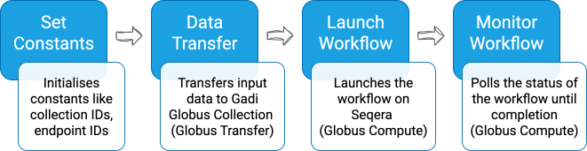

# Gadi Genomics Globus Flow

This repository provides a proof-of-concept Globus Flow that automates data transfer and execution of a Nextflow workflow on NCI Gadi via the Seqera Platform API. The flow:

1. Transfers input data from a source Globus Collection to a writable Globus Collection on Gadi (uses *Globus Transfer*)
2. Launches a Nextflow workflow on Gadi via the Seqera Platform API (uses *Globus Compute*)
3. Monitors workflow execution via the Seqera Platform API (uses *Globus Compute*)

<p align="center" style="margin-top: 20px;">
  
</p>
<p align="center">
  <em>Figure 1: Globus Flow Diagram</em>
</p>

## Prerequisites

Before setting up the flow, ensure you have access to:

1. A writable Globus Collection on Gadi with UUID `<gadi_collection_id>` and its absolute path on Gadi (`<gadi_globus_root>`).

2. The [Seqera Platform](https://seqera.services.biocommons.org.au/) and have configured a *primary* compute environment, connecting to Gadi via the Tower Agent with ID `<seqera_compute_env_id>`.

3. The [oncoanalyser v2.2.0](https://kisarur.github.io/workflow-catalogue/view_documentation.html?name=oncoanalyser&version=2.2.0) Nextflow workflow installed on Gadi.   

## Setting Up the Flow

1. Clone the repository on Gadi:

```bash
git clone https://github.com/kisarur/gadi-genomics-globus-flow.git
cd gadi-genomics-globus-flow
```

2. Create a Python virtual environment with the required dependencies:

```bash
module load python3/3.11.0
python3 -m venv .venv
source .venv/bin/activate

pip install globus-compute-sdk==3.7.0 \
            globus-compute-endpoint==3.7.0 \
            globus-cli==3.34.0
```

All subsequent Globus-related steps must be executed with this virtual environment activated. If needed, reactivate it with:

```bash
module load python3/3.11.0
source .venv/bin/activate
```

3. Register the compute functions and record the returned UUIDs for the `launch_workflow` (`<launch_workflow_fuuid>`) and `monitor_workflow` (`<monitor_workflow_fuuid>`) functions:

```bash
python compute_functions/register_compute_functions.py
```

4. Inside a terminal multiplexer session (e.g., [screen](https://linux.die.net/man/1/screen)) created within a [persistent session on Gadi](https://opus.nci.org.au/spaces/Help/pages/241926895/Persistent+Sessions), set your Seqera API token and configure and start a Globus Compute Endpoint:

```bash
export SEQERA_API_ACCESS_TOKEN=<your_seqera_api_access_token>
globus-compute-endpoint configure <endpoint_name>  # run once
globus-compute-endpoint start <endpoint_name>
```

Record the endpoint UUID as `<gadi_compute_endpoint_id>`.

5. Edit the following constants in `globus_flow/flow_definition.json` (Lines 7-12) with your recorded values:

- `<gadi_collection_id>`
- `<gadi_compute_endpoint_id>`
- `<seqera_compute_env_id>`
- `<launch_workflow_fuuid>`
- `<monitor_workflow_fuuid>`
- `<gadi_globus_root>`

6. Create/register the Globus Flow:

```bash
globus login
globus flows create "Gadi Genomics Globus Flow" \
  globus_flow/flow_definition.json \
  --input-schema globus_flow/flow_schema.json
```

## Running the Flow

1. Prepare input files on your source Globus Collection. For a local machine, you can use [Globus Connect Personal](https://www.globus.org/globus-connect-personal) to create a Globus Collection.

See the `demo_inputs/` directory of this repository for an example structure:

- `demo_data/` folder, containing demo dataset (download data using `download_demo_data.sh`)
- `samplesheet.csv`, listing input samples [formatted as the workflow expects](https://github.com/nf-core/oncoanalyser/tree/2.2.0?tab=readme-ov-file#usage)
- `params.yml`, containing workflow parameters (make sure to edit `project` and `storage` to match your Gadi project and storage requirements).

**Note:** The `{input_destination}` placeholder can be used in `samplesheet.csv` and `params.yml` to dynamically reference the destination folder on Gadi where input files will be copied to.

2. Start the Globus Flow via the Globus web UI:
  <ol type="i">
      <li>Go to: <a href="https://app.globus.org/flows/library">https://app.globus.org/flows/library</a></li>
      <li>Start "Gadi Genomics Globus Flow"</li>
      <li>Provide the required inputs using the form (generated from <code>globus_flow/flow_schema.json</code>)</li>
  </ol>

Example inputs:

- `input_source.path`: `/path/to/source/demo_inputs/`
- `input_destination`: `/oncoanalyser-demo-inputs/`
- `workflow_params_file`: `/oncoanalyser-demo-inputs/params.yml`
- `workflow_output_directory`: `/oncoanalyser-demo-output/`
- `workflow_work_directory`: `/oncoanalyser-demo-work/`

3. To track the progress of the Globus Flow, click **View Run Details** and then open the **Event Log** tab.

4. Once the Globus Flow transitions to the *MonitorWorkflow* stage, workflow execution can be monitored via the Seqera UI: https://seqera.services.biocommons.org.au/user/your-user-name/watch

## Troubleshooting and Support

If you encounter issues or need further clarification, please open an issue in this repository.